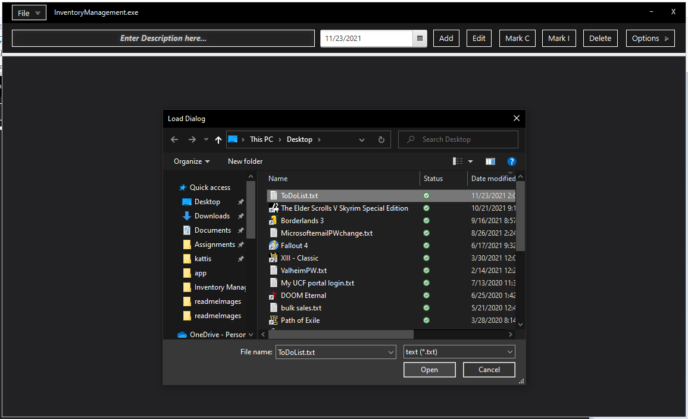

# king-Application-impl

Welcome to the Todo List program!

---

### Table of Contents

- [Description](#description)
- [How To Use](#how-to-use)
- [Add](#add)
- [Delete](#delete)
- [Delete All](#delete-all)
- [Edit](#edit)
- [Mark Complete](#mark-complete)
- [Mark Incomplete](#mark-incomplete)
- [Display Complete](#display-complete)
- [Display Incomplete](#display-incomplete)
- [Display All](#display-all)
- [Save](#save)
- [Load](#load)
- [Author Info](#author-info)

---

## Description

Users are able to manage a Todo List via the Text box, the Date Picker, and the provided buttons.

[Back To The Top](#table-of-contents)

---

## How To Use

Below are details on the features of the program with included screenshots.

---

## Add

In order to use the Add button 2 pre-Conditions must be met.
>1) The text field and DatePicker must be entered.
>2) The text field and DatePicker entries must be in valid format.

> Valid add process on an empty list:
>
> 
>
> After the entry was added:
>
> 

[Back To The Top](#table-of-contents)

---

## Delete

In order to use the Delete button 1 pre-Condition must be met.
>1) An entry must be selected before clicking Delete. Therefore, Delete may not be used on an empty list.

> Valid delete process on an occupied list (Before pressing Delete):
>
> 
>
> Valid delete process on an occupied list (After pressing Delete):
>
> 

[Back To The Top](#table-of-contents)

---

## Delete All

DeleteAll may be used without any preconditions, however, it only makes sense to use when the list isn't empty.

> DeleteAll process on an occupied list (Before pressing DeleteAll):
>
> 
>
> After pressing DeleteAll:
>
> 

[Back To The Top](#table-of-contents)

---

## Edit

In order to use the Edit button 2 pre-Conditions must be met.
> 1) An entry must be selected before clicking Edit. Therefore, Edit may not be used on an empty list.
> 2) The text field and DatePicker must contain a valid entry for the edit to process.

> Edit process on an occupied list (Before pressing Edit):
>
> 
>
> After pressing Edit:
>
> Edit button name changes from 'Edit' to 'Save'.
> The entry to be edited will then be displayed in their respective Description Text Fields.
>
> 
>
> The user must then click Save to apply their new edit.
>
> 
>
> After edit process goes through correctly:
>
> 

[Back To The Top](#table-of-contents)

---

## Mark Complete

Changes the status of a list entry from incomplete to complete.

In order to use Mark Complete 1 pre-Condition must be met.
> 1) There must be at least one entry in the list.

> Mark Complete process on an occupied list (Before pressing Mark C):
>
> 
>
> After pressing Mark C:
>
> The Entry will now have a status of complete.
>
> 

[Back To The Top](#table-of-contents)

---

## Mark Incomplete

Changes the status of a list entry from complete to incomplete.

In order to use Mark Incomplete 1 pre-Condition must be met.
> 1) There must be at least one entry in the list.

> Mark Incomplete process on an occupied list (Before pressing Mark I):
>
> 
>
> After pressing Mark I:
>
> The Entry will now have a status of incomplete.
>
> 

[Back To The Top](#table-of-contents)

---

## Display Complete

In order to use Display Complete 1 pre-Condition must be met.
> 1) There must be an existing entry in the list with a status of Complete.

> Search process on an occupied list (Before pressing Display Complete from the Options menu):
>
> 
>
> After pressing Display Complete:
>
> The list will now be filtered to only display completed items.
>
> 

[Back To The Top](#table-of-contents)

---

## Display Incomplete

In order to use Display Incomplete 1 pre-Condition must be met.
> 1) There must be an existing entry in the list with a status of Incomplete.

> Search process on an occupied List (Before pressing Display Incomplete from the Options menu):
>
> 
>
> After pressing Display Incomplete:
>
> The list will now be filtered to only display incomplete items.
>
> 

[Back To The Top](#table-of-contents)

---

## Display All

In order to use Display Incomplete 1 pre-Condition must be met.
> 1) There must be an existing entry in the list.

> Display All process on an occupied list (Before pressing Display All from the Options menu):
>
> 
>
> After pressing Display All:
>
> The list will now return to its original state.
>
> 

[Back To The Top](#table-of-contents)

---

## Save

Saves the Contents of the list to a .txt file

> Save process on an occupied list (Before pressing Save):
>
> 
>
> After pressing Save:
>
> The file chooser window appears for the user to enter save information.
>
> 

Note: An unsaved changes warning message is shown if the user tries to terminate the program after adding, deleting, editing, or sorting.
>  The user has the choice to CANCEL and save or click OK and terminate.
>
> 

[Back To The Top](#table-of-contents)

---

## Load

Loads the contents of the file to the list. Handles .txt file type

> Load process on an occupied list (Before pressing Load):
>
> 
>
> After pressing Load:
>
> The file chooser window appears for the user to choose a file to load.
>
> 

[Back To The Top](#table-of-contents)

---

## Author Info

- Tyler King - UCF Comp Science Student
- Email - tylerking885@gmail.com

[Back To The Top](#table-of-contents)
	